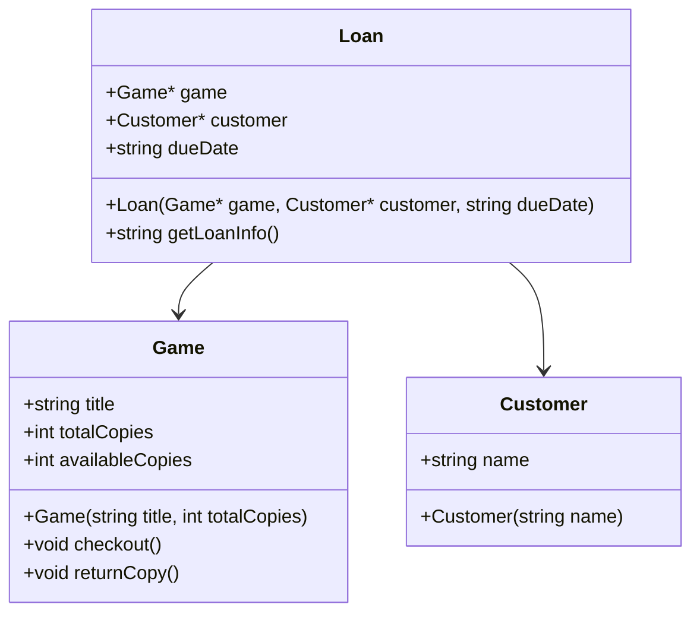

# Practice11 – Board Game Lending System

## 1. Program Specification

This program is a lightweight lending management tool for a local board game café. It tracks board games in inventory, their availability, and current borrowers. Staff members can check out games to customers, record due dates, and mark games as returned. The system uses basic class structures to represent games, customers, and loans, and provides functions for listing inventory and active loans.

---

## 2. Nouns and Verbs

### Nouns
- **Game** → class  
- **Customer** → class  
- **Loan** → class  
- **Title**, **Name**, **Copies**, **Due Date** → attributes  

### Verbs
- **checkout()** → method on `Game`  
- **returnCopy()** → method on `Game`  
- **listGames()** → function to display inventory  
- **listLoans()** → function to display active loans  
- **getLoanInfo()** → method on `Loan`  

---

## 3. Class Declarations

```cpp
class Game {
public:
    std::string title;
    int totalCopies;
    int availableCopies;

    Game(const std::string& title, int totalCopies);
    void checkout();
    void returnCopy();
};

class Customer {
public:
    std::string name;

    Customer(const std::string& name);
};

class Loan {
public:
    Game* game;
    Customer* customer;
    std::string dueDate;

    Loan(Game* game, Customer* customer, const std::string& dueDate);
    std::string getLoanInfo() const;
};
```

---

## 4. Class Diagram


